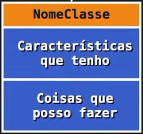

# POO
Introdução a programação orientadada a objetos

- Classes são moldes utilizados para criar objetos
- Atributos: características da classe
- Métodos: ações que podem ser realizadas
- Instanciamento: quando a classe gera um objeto
- Objetos x variáveis:
    Objetos são uma variável que podem guardar dados e podem fazer coisas com esses dados
    Variáveis apenas guardam os dados

