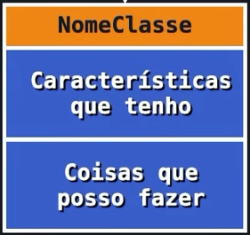

# POO
Introdução a programação orientadada a objetos

- Classes são moldes utilizados para criar objetos
- Atributos: características da classe
- Métodos: ações que podem ser realizadas
- Instanciamento: quando a classe gera um objeto
- Objetos x variáveis:
    Objetos são uma variável que podem guardar dados e podem fazer coisas com esses dados
    Variáveis apenas guardam os dados

- Dunder atributte
    __class__
    __dict__
    __doc__

- Dunder method
    __getstate__
    __str__

- Os 4 pilares da POO
    Abstração
    Encapsulamento
    Herança
        Quando uma classe herda todos métodos e atributos de outra classe
        - Superclasse 
            Classe base, classe ancestral ou classe mãe
        - Subclasse
            Herda coisas da superclasse
            Classe derivada, classe filha e descendente
            Uma subclasse pode ser uma superclasse de outras classes
        Vantagens:
            - Reutilização de código
            - Organização hierárquica
            - Facilita a manutenção
            - Extensibilidade
            - Suporte a polimorfismo 
            
        Herançã é uma generalização
    Polimorfismo